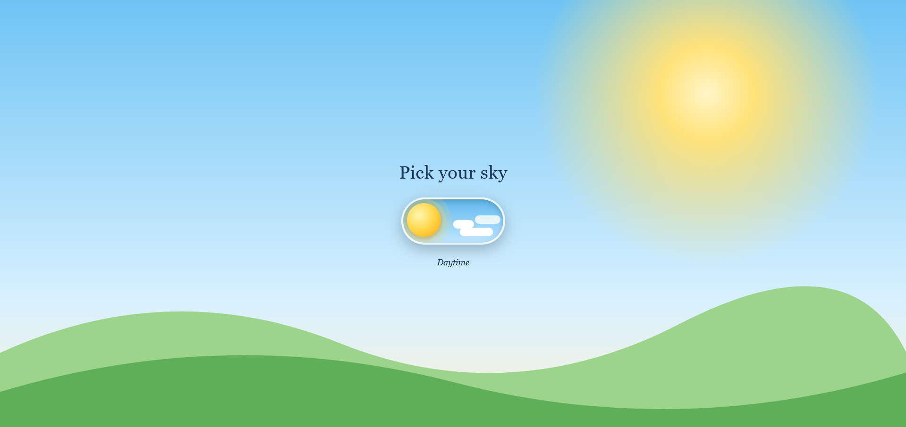
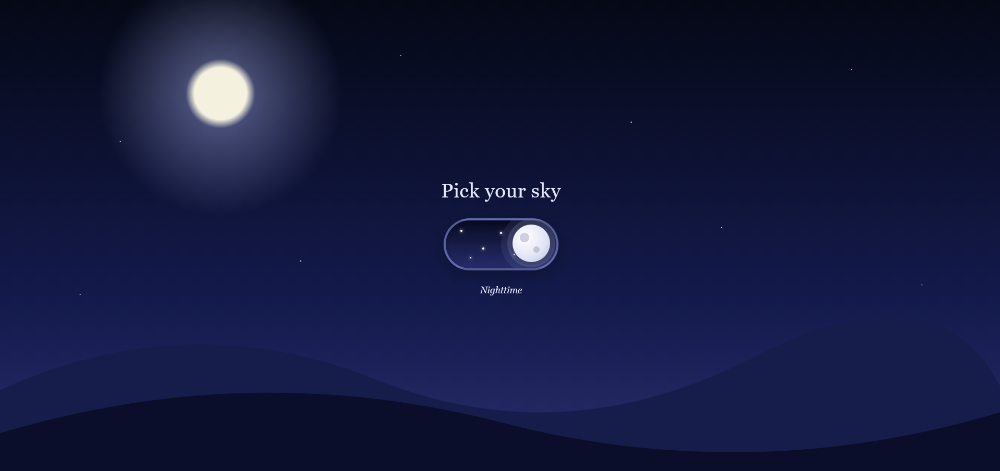

# Pick Your Sky ☀️🌙

A small web app with an animated toggle switch that flips the whole page between **daytime** and **nighttime**. Built with **Java** and **Spring Boot**.

## Preview

| Daytime | Nighttime |
|---------|-----------|
|  |  |

## Features

- Animated toggle switch (sun ↔ moon)
- Full-page theme change: sky gradient, sun/moon glow, stars, clouds and hills
- Label updates with the mode (*Daytime* / *Nighttime*)
- Lightweight, no database needed
